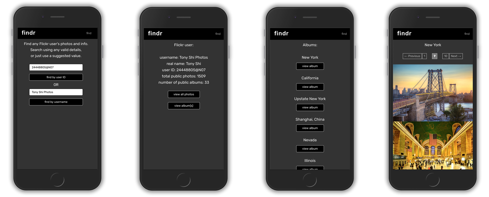
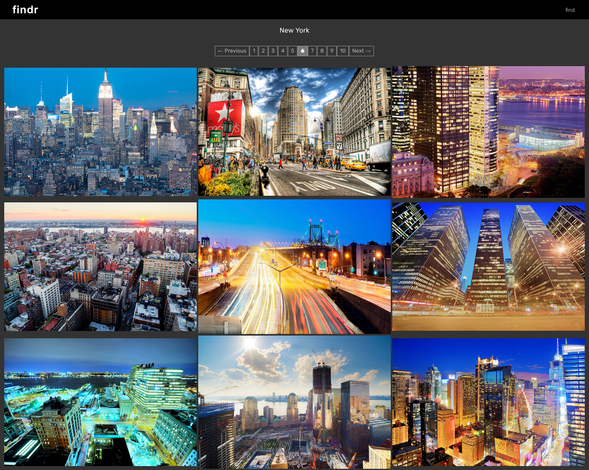
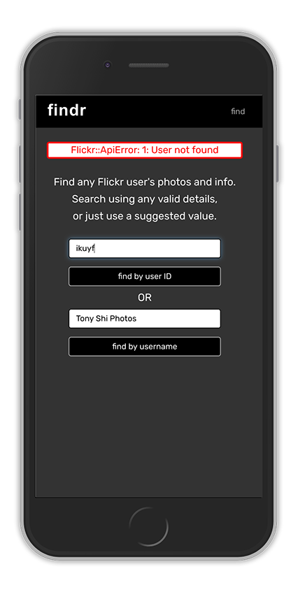
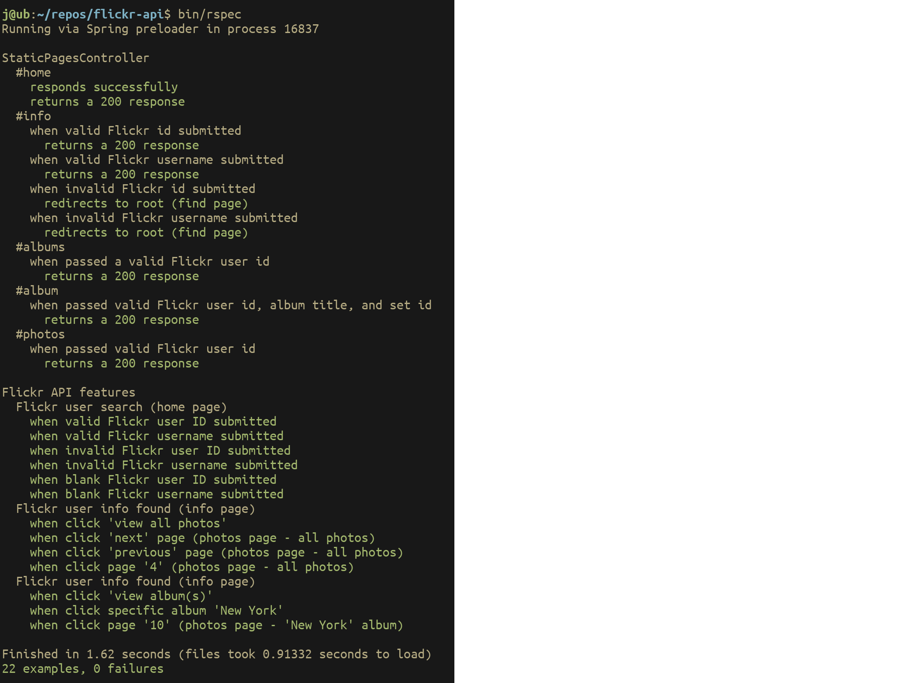

# Flickr-API

Simon Tharby's solution to [Project 2: Using a Third Party API](https://www.theodinproject.com/courses/ruby-on-rails/lessons/apis?ref=lnav), Project: APIS, Ruby on Rails unit, Odin Project.

[View in browser](https://findr-simontharby.herokuapp.com/)

## My additional features:

As well as satisfying the project criteria, I also added the following features:

  * mobile/desktop responsive layout (all views)
  * pagination of photo display, using 'will-paginate' gem
  * find Flickr user via user id or username
  * return basic info of Flickr user (id, username, real name, total public photos count, public albums count)
  * view all Flickr user's photos or view by album (select album title)
  * clicking on photo redirects to Flickr photo page
  * error handling for form submission (including Flickr-API errors)
  * full suite of Rspec tests, including use of of [VCR Gem](https://github.com/vcr/vcr) for all tests which involve an expected response from the Flickr API.

## Screenshots:

Find user form(s) -> User info: select 'view album(s)' -> Album list: select 'view album(s)' "New York" -> View album



Desktop layout:



Example Flickr-API error on form submission:



## Rspec tests

Notes:
  * I am aware that controller tests were 'soft deprecated' in Rails 5, but I included them here for my own practice with Rspec.
  * Includes use of [VCR Gem](https://github.com/vcr/vcr) for all tests which involve an expected response from the Flickr API.

Output of running all Rspec tests:



## Getting started:

To get started with the app, clone the repo and then install the needed gems:

```
$ bundle install --without production
```

Next, migrate the database (required to create schema.rb for rspec to function, despite the app not using database(s)):

```
$ rails db:migrate
```

Finally, run the test suite to verify that everything is working correctly:

```
$ bin/rspec
```

If the test suite passes, you'll be ready to run the app in a local server:

```
$ rails server
```
